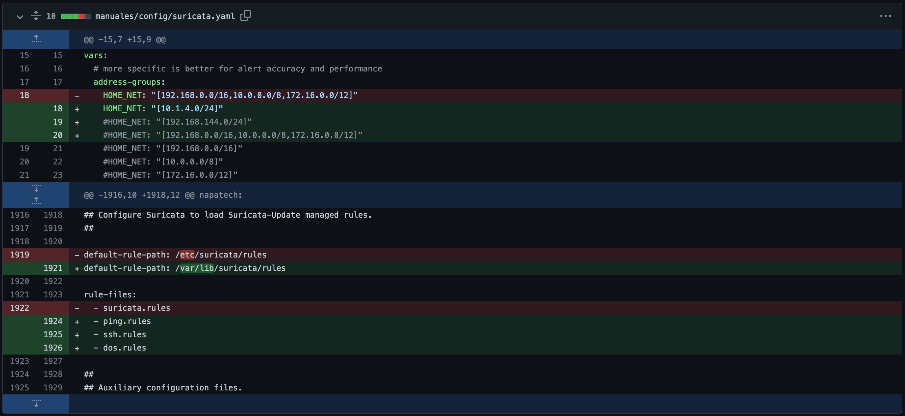

## Instalación
```
sudo apt-get install suricata -y
```

## Comprobar estado del IDS
```
systemctl status suricata
```
Inicialmente debería aparecer como _disabled_.

## Descarga, descompresión y limpieza de reglas de la comunidad
```
wget http://rules.emergingthreats.net/open/suricata/emerging.rules.tar.gz;tar zxvf emerging.rules.tar.gz;rm emerging.rules.tar.gz
```

## Mover directorio de reglas a su destino final
```
sudo mv rules /var/lib/suricata/
```

## Backup del archivo de configuración
```
sudo cp /etc/suricata/suricata.yaml /etc/suricata/suricata.yaml.back
```

## (sólo en caso de querer dejarlo como al principio)
## Recuperar archivo de configuración original
```
sudo mv /etc/suricata/suricata.yaml.back /etc/suricata/suricata.yaml
```

## Creación de reglas

### Regla de detección de ping

#### Definición de la regla

alert icmp any any -> $HOME_NET any (msg:"Intento de conexión ICMP"; sid:1000002; rev:1;)

| acción|descripción|
| ------------- |:-------------:|
|alert| Generar una alerta|

| protocolo|descripción|
| ------------- |:-------------:|
|icmp| Ping|

| IP_origen|descripción|
| ------------- |:-------------:|
|any| cualquiera |

| puerto_origen|descripción|
| ------------- |:-------------:|
|any| cualquiera |

| IP_destino|descripción|
| ------------- |:-------------:|
|$HOME_NET| red/es a monitorizar; especificadas en el archivo  /etc/suricata/suricata.yaml |

| puerto_destino|descripción|
| ------------- |:-------------:|
|any| cualquiera |

__msg:__ Mensaje de alerta <br>
__sid:__ Identificador <br>
__rev:__ Versión <br>

#### Creación del archivo que contiene la regla
```
echo 'alert icmp any any -> $HOME_NET any (msg:"Intento de conexión ICMP"; sid:1000002; rev:1;)' > /var/lib/suricata/rules/ping.rules
```


### Regla de detección de intento de conexión SSH

#### Definición de la regla

alert tcp any any -> $HOME_NET 22 (msg:"SSH connection attempt"; sid:1000003; rev:1;)

| acción|descripción|
| ------------- |:-------------:|
|alert| Generar una alerta|

| protocolo|descripción|
| ------------- |:-------------:|
|tcp| Transport Control Protocol|

| IP_origen|descripción|
| ------------- |:-------------:|
|any| cualquiera |

| puerto_origen|descripción|
| ------------- |:-------------:|
|any| cualquiera |

| IP_destino|descripción|
| ------------- |:-------------:|
|$HOME_NET| red/es a monitorizar;especificadas en el archivo  /etc/suricata/suricata.yaml |

| puerto_destino|descripción|
| ------------- |:-------------:|
|22| puerto ssh por defecto |

__msg:__ Mensaje de alerta <br>
__sid:__ Identificador <br>
__rev:__ Versión <br>

#### Creación del archivo que contiene la regla
```
echo 'alert tcp any any -> $HOME_NET 22 (msg:"SSH connection attempt"; sid:1000003; rev:1;)' > /var/lib/suricata/rules/ssh.rules
```


### Regla de detección de denegación de servicio (DoS) por el puerto 80

#### Definición de la regla

alert tcp any any -> $HOME_NET 80 (msg:"Potential DDoS por el puerto 80"; flags: S,12; threshold: type both, track by_dst, count 500, seconds 5; classtype:misc-activity; sid:6;)


| acción|descripción|
| ------------- |:-------------:|
|alert| Generar una alerta|

| protocolo|descripción|
| ------------- |:-------------:|
|tcp| Transport Control Protocol|

| IP_origen|descripción|
| ------------- |:-------------:|
|any| cualquiera |

| puerto_origen|descripción|
| ------------- |:-------------:|
|any| cualquiera |

| IP_destino|descripción|
| ------------- |:-------------:|
|$HOME_NET| red/es a monitorizar; especificadas en el archivo  /etc/suricata/suricata.yaml |

| puerto_destino|descripción|
| ------------- |:-------------:|
|80| puerto http por defecto |

__msg:__ Mensaje de alerta <br>
__count:__ Número de peticiones <br>
__seconds:__ Intervalo de tiempo <br>
__sid:__ Identificador <br>

#### Creación del archivo que contiene la regla
```
echo 'alert tcp any any -> $HOME_NET 80 (msg:"Potential DDoS por el puerto 80"; flags: S,12; threshold: type both, track by_dst, count 500, seconds 5; classtype:misc-activity; sid:6;)' > /var/lib/suricata/rules/dos.rules
```


## Archivo de configuración
### Opcion a: 
### Copia del fichero ya configurado
#### Descarga y reubicación del fichero
```
wget https://raw.githubusercontent.com/elliot-alders0n/seguridad/main/manuales/config/suricata.yaml;sudo mv suricata.yaml /etc/suricata/
```
#### Resumen de cambios


### Opcion b:
### Paso a paso

#### Edición del archivo de configuración
```
sudo nano /etc/suricata/suricata.yaml
```

#### Comentar HOME_NET actual:
* Buscar la línea que empieza por _HOME_NET_
Ctrl + W , escribir HOME_NET
* Escribir un # delante (#HOME_NET:...)

#### Establecer la red a monitorizar:

Encima de la línea comentada escribir:<br>
HOME_NET: "[<red/es separada/s por comas>]"<br>
Ejemplo: <br>
```
HOME_NET: "[10.1.4.0/24]"
```

#### Definir la nueva ubicación de las reglas
* Buscar la línea que empieza por _default-rule-path_
Ctrl + W , escribir default-rule-path
* Escribir delante de _default-rule-path:_ la ruta donde están alojadas nuestras reglas:
```
/var/lib/suricata/rules
```
#### Incluir el nombre de las reglas creadas previamente
* Buscar la línea que empieza por _rule-files:_
* Eliminar la línea que contenga (- suricata.rules)
* Añadir cada una de las reglas en líneas distintas debajo de (rule_files:)
```
- ping.rules
```

```
- ssh.rules
```

```
- dos.rules
```

## Activar suricata
```
sudo systemctl start suricata
```
## Ejecución de suricata
```
sudo suricata -c /etc/suricata/suricata.yaml -i eth0
```

## Ubicación de los logs de suricata

/var/log/suricata/

## Mostrar log en tiempo real
tail -f /var/log/suricata/fast.log

## Mostrar últimas 10 líneas del log
```
cat /var/log/suricata/fast.log | tail -n 10
```
